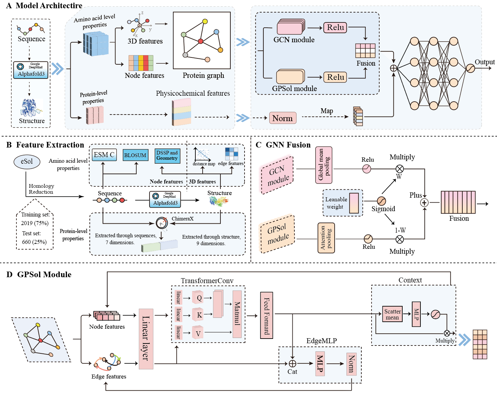

# Intoduction
To more accurately predict protein solubility, we propose a new model called FGNNSol. The workflow of this model is as follows: 

First, it uses AlphaFold3 to predict the 3D structure of proteins, constructs edges and generates edge features based on this structural information, and simultaneously takes ESM-C and other features as node features to jointly build protein graphs. Then, the model trains an ensemble model that combines GPSol (an improved Graph Attention Network) and Graph Convolutional Networks (GCNs). Finally, the model concatenates the fused representations from these networks with global protein features, and inputs the concatenated vector into a Multilayer Perceptron (MLP) to output the prediction results. 

Experiments demonstrate that this model outperforms other existing prediction models. Here, we open-source our code for reproduction and usage.

# System requirement
FGNNSol is mainly based on the following packages:
- python 3.9
- numpy 1.24.3
- pandas 1.5.3
- torch 2.2.2+cu121
- torch-cluster 1.6.3+pt22cu121	
- torch-geometric 2.6.1
- pytorch-scatter 2.1.2+pt22cu121
- biopython 1.85
- bio 1.6.2
- fair-esm 2.0.0
- sentencepiece 0.2.0
- transformers 4.37.2
- seaborn 0.13.2
- matplotlib-inline	0.1.7
- scikit-learn	1.6.1
- ipython	8.18.1
- iFeatureOmegaCLI	1.0.2
- rdkit	2025.3.1

# Install and set up FGNNSol
1. Clone this repository by `git clone https://github.com/SCrownJ/FGNNSol`
2. Install the packages required by FGNNSol. The packages required by FGNNSol are listed above.
3. Please visit https://github.com/evolutionaryscale/esm?tab=readme-ov-file#esm-c- to obtain the ESM-C model code, and download the ESMC_600M model weights from https://huggingface.co/EvolutionaryScale. 
4. The tool to extract dssp is located at `./feature_extraction/mkdssp.exe`. Add permission to execute for DSSP by `chmod +x ./feature_extraction/mkdssp.exe`
5. Visit https://www.rbvi.ucsf.edu/chimerax/download.html, download and install ChimeraX on your computer.

# Run FGNNSol for prediction
1. To make predictions using our model, first, you need to refer to `./feature_extraction/readme.md` and extract features according to the description in this file. 
2. Run the `predict.py` code. 
3. After the prediction is completed, a file named `predictions.csv` will be output in the current directory, which records the prediction results.

# Dataset and model
We provide the datasets and the  trained models here for those interrested in reproducing out paper.

The trained FGNNSol model for predicting protein solubility is located at `./check_point/best_model/best_model.pt`.

Our training set, test set, and evaluation set data are stored in `./dataset/`. The .pkl files located in the pkl folder can be directly used for training, testing, and prediction.

In the dataset folder, train_data stores training set data, eval_data stores validation set data, test_data stores test set data, and val1_scere_data stores external test set data (i.e., the Saccharomyces cerevisiae dataset).

The pkl folder of training set, which contains a large number of large files, is stored on Google Drive: https://drive.google.com/drive/folders/11-Zxt0rXgfxb635Yz043xhVP7FMlrTni?usp=drive_link

# Re-train the model
In the `./dataset/` directory, we have provided the original data (stored in .csv files) and the data with all features extracted, which can be directly used for training and testing (in the .pkl files located in the pkl folder). You can either directly use our .pkl file for training, or extract features yourself for training. 

You can directly run `train.py` to retrain our model. If you want to extract features yourself, please refer to the description in `./dataset/readme.md` for feature extraction, and then run `train.py`.

